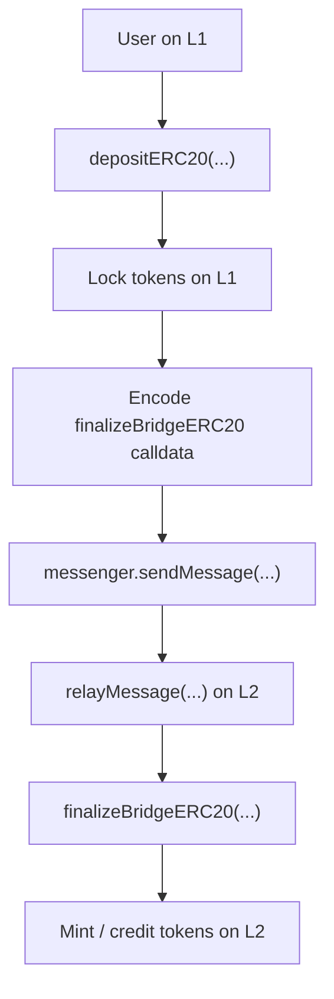
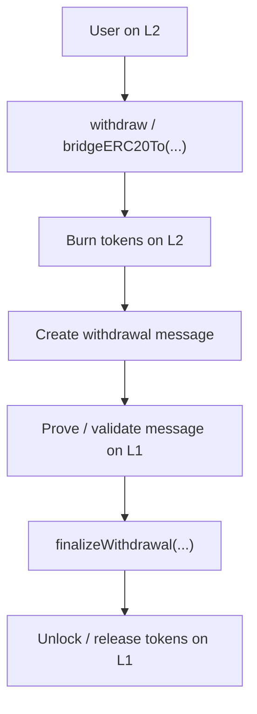

# Optimism Bridge Flow Local Review

This repository is an educational local review of an Optimism-style bridge flow.

The goal is to practice bridge security thinking:

```text
Understand the flow -> Define invariants -> Search for violations
```

This is not a full production audit. It is a study repository focused on bridge
architecture, function-by-function review, message passing, replay protection,
auth boundaries, and accounting invariants.

## Bridge Model

### Deposit Flow: L1 -> L2



Main deposit invariant:

```text
L1 locked amount = L2 minted amount
```

### Withdrawal Flow: L2 -> L1



Main withdrawal invariant:

```text
L2 burned amount = L1 released amount
```

## Repository Structure

```text
optimism-bridge-flow-local-review/
+-- README.md
+-- deposit-flow/
|   +-- 01-depositERC20.md
|   +-- 02-relayMessage.md
|   +-- 03-finalizeBridgeERC20.md
+-- withdrawal-flow/
|   +-- 01-withdraw-or-bridgeERC20To.md
|   +-- 02-burn.md
|   +-- 03-finalizeWithdrawal.md
+-- breaksync/
    +-- README.md
    +-- deposit-break-think.md
    +-- withdrawal-break-think.md
```

## Global Invariants

### Deposit Invariants

```text
L1 locked amount = L2 minted amount
```

```text
The L1 token must map to the correct L2 token.
```

```text
The recipient encoded in the message must be the intended recipient.
```

```text
The deposit message must be sent to the trusted counterpart bridge.
```

```text
The deposit message must be finalized only through an authentic messenger path.
```

```text
The same deposit message must not be executed twice.
```

### Withdrawal Invariants

```text
L2 burned amount = L1 released amount
```

```text
The L2 token must map to the correct L1 token.
```

```text
The withdrawal recipient must be the intended recipient.
```

```text
The withdrawal message must be created only after the burn step.
```

```text
The withdrawal message must be finalized only through an authentic messenger path.
```

```text
The same withdrawal message must not be executed twice.
```

### Messenger Invariants

```text
Only the trusted messenger can relay messages.
```

```text
The message hash must uniquely identify the sender, target, and calldata.
```

```text
The message must be marked as executed before the external target call.
```

```text
Validation must happen before execution.
```

```text
The target must be the intended destination contract.
```

## What I Practiced

- Deposit flow analysis
- Withdrawal flow analysis
- Message authenticity
- Replay protection
- `xDomainMessageSender`
- Ghost mint risk
- Fake release risk
- Accounting invariants
- Token conservation across chains

## Core Security Idea

```text
Real state transition
-> message creation
-> message validation
-> execution
-> mint / release
```

If this relationship breaks, the message stops being proof of real state.

That can lead to:

```text
ghost mint
fake release
replay
double spend
unbacked liquidity
broken bridge accounting
```
